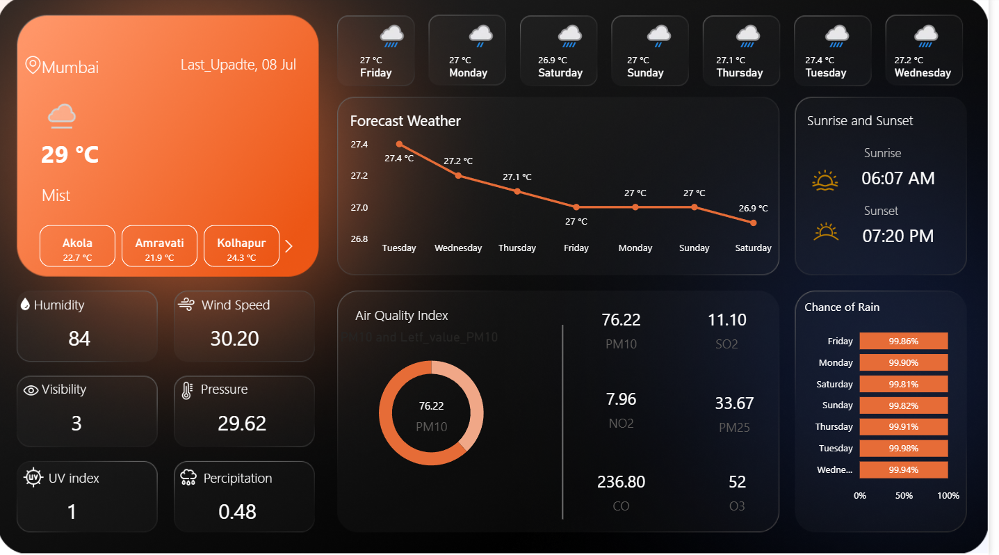

# 🌦 Weather Forecast Dashboard - Power BI Project

## 📊 Project Overview

This Power BI project presents an interactive **Weather Forecast Dashboard** that visualizes key weather indicators to help users understand weather patterns and trends over time. The dataset has been modeled and visualized to support dynamic filtering, insightful comparisons, and real-time storytelling using modern visuals.

## 📁 File

* `Weather_Forcast.pbix`: Main Power BI file containing the report with visuals, DAX calculations, and dashboard layout.

## 📌 Key Features

* 📍 **Location-wise Forecast**: Track weather conditions across different cities or regions.
* 📈 **Temperature Trends**: Analyze maximum and minimum temperature patterns over time.
* 🌧 **Precipitation & Humidity**: Explore rainfall and humidity trends.
* 🌬 **Wind Speed Analysis**: View wind strength variations and their historical data.
* ⏱ **Time-based Filtering**: Slicers for daily, weekly, or monthly analysis.
* 📱 **Modern UI Design**: Inspired by web dashboards with card visuals, clean fonts, and KPI indicators.

## 📷 Sample Visuals

> *(Add screenshots of your dashboard here by uploading `.png` or `.jpg` images)*
> Example:
> 

## 🧠 Skills Demonstrated

* Power BI Desktop
* Data Modeling
* DAX Calculations
* Data Cleaning and Transformation
* UX-focused Dashboard Design
* Time Intelligence

## 🛠 Tools Used

* Power BI Desktop
* DAX
* Power Query Editor

## 🧾 How to Use

1. Clone or download this repository.
2. Open the `Weather_Forcast.pbix` file using Power BI Desktop.
3. Explore the dashboard using filters and visuals.
4. Connect to a live data source (optional) for real-time updates.

## 📈 Future Enhancements

* Integrate with live weather APIs.
* Add geospatial maps for city-level analysis.
* Enable report sharing via Power BI Service with auto-refresh.

---

